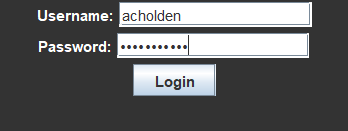
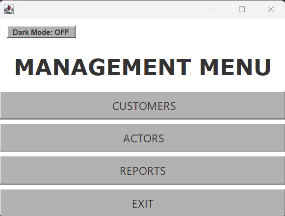
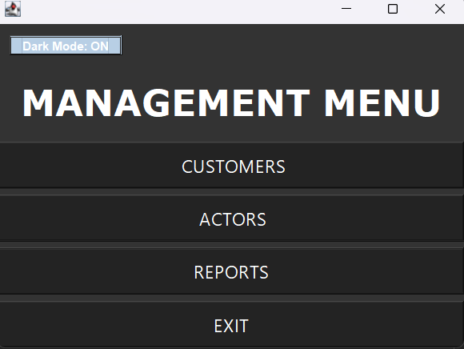
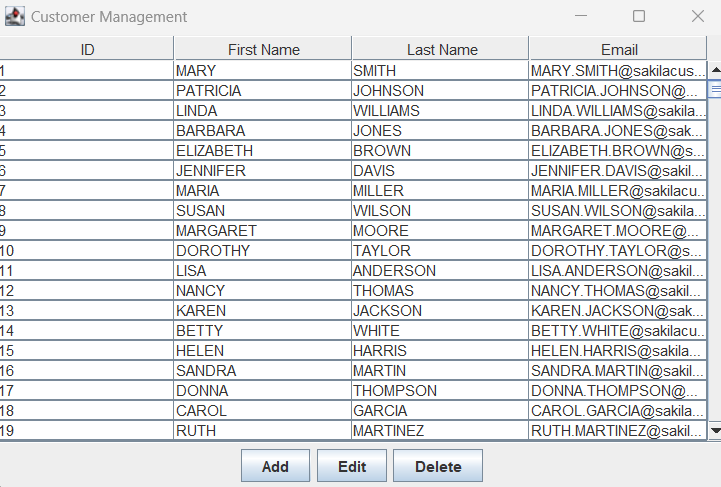
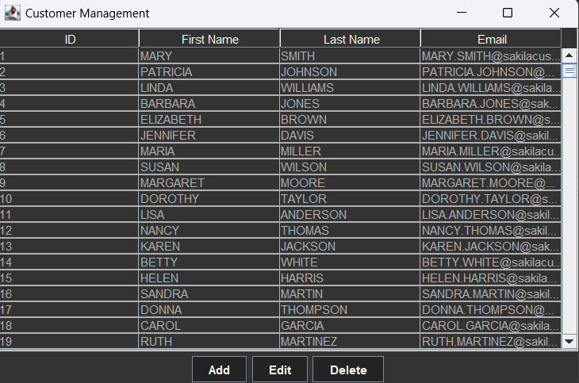
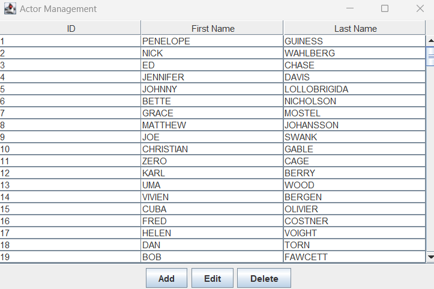
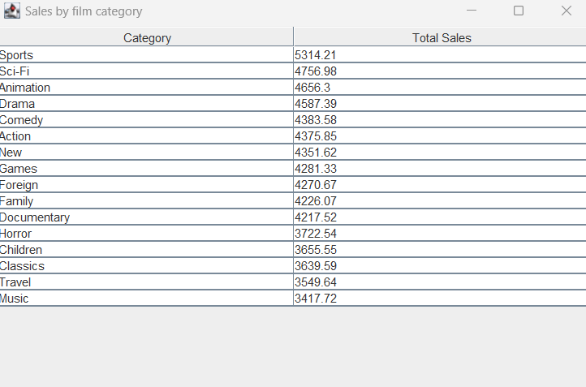
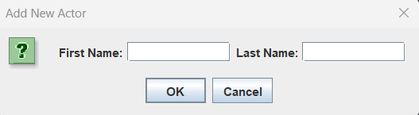
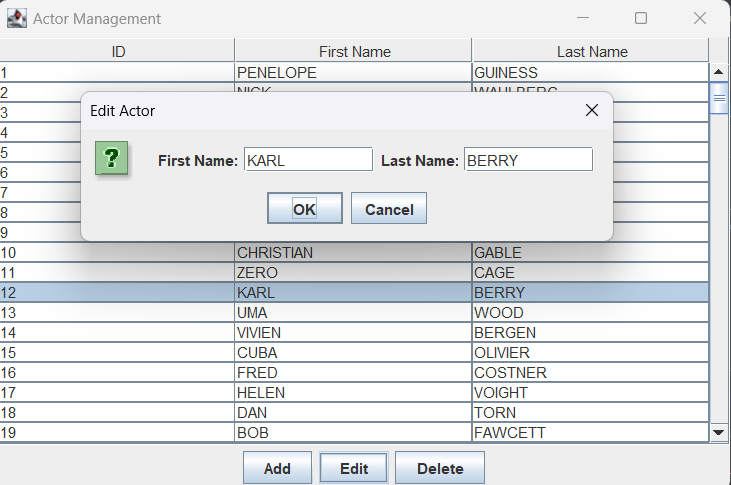
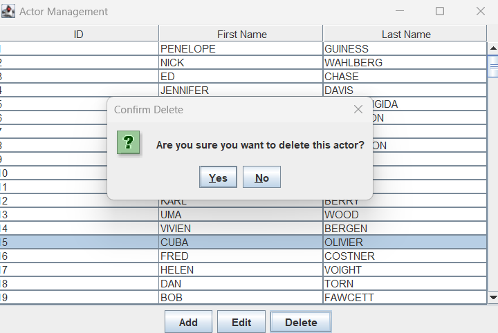

# Management System - Final Project
## Author
Anthony Holden 
Catawba College 
CIS 3400 Advanced Programming, Fall 2024 
Dr. Pamela Thompson (instructor) 

## Purpose

The final project consists of programming and implementing an advanced Java application that demonstrates database connectivity with CRUD (Create, Read, Update, Delete) actions on relational database tables using a GUI interface. The application requires a login to the database (Sakila in MySQL), with GUI forms using Swing for a main interface and selections for creating, reading, updating and deleting records from tables in Sakila, and a report.
 

## Project Features
The login screen is directly linked to the SQL database. It checks through the database users/passwords and ensures it is correct, instead of the users being hard-coded into Netbeans.  

The main menu also includes a "Dark Mode" button that changes the theme colors of each page. Good for when you don't want the brightness from the white burning your eyes! The mode is implemented throughout every page and is consistent even when exiting back to the main menu.

 
 

## Screenshots
  Main menu: 
   
  
  Customers Form: 
   
  Dark Version: 
   
  Actors Form: 
   
  Reports Form: 
   

  CRUD Pop-ups:  
  Add Pop-up:  
   
  Edit Pop-up:  
   
  Delete Pop-up:  
   

 

## Code
All the code for this project can be found in the master branch  

## Software Specifications

Software specifications: 
  Java  
  MySQL  
  Netbeans 21 

 

## Contact Information
Anthony Holden
acholden22@catawba.edu
